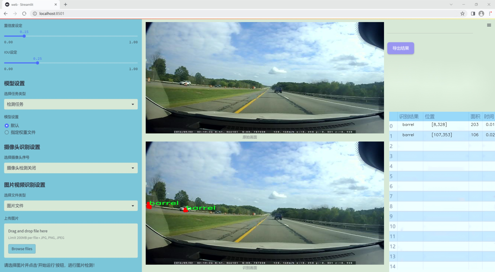

### 1.背景意义

### 研究背景与意义

随着城市化进程的加快，高速公路建设与维护工作日益频繁，施工区域的安全管理成为亟待解决的重要问题。在高速公路施工区域，工人和设备的安全是首要考虑因素，而有效的物体检测系统能够显著提高施工现场的安全性与工作效率。传统的人工监控方式不仅耗时耗力，而且容易出现疏漏，因此，基于计算机视觉的自动化检测系统逐渐成为研究的热点。

本研究旨在开发一种基于改进YOLOv11的高速公路施工区域物体检测系统。YOLO（You Only Look Once）系列模型因其高效的实时检测能力而广泛应用于各种视觉任务。通过对YOLOv11进行改进，结合针对特定施工区域的特征，我们期望提升其在复杂环境下的检测精度和速度。该系统将能够自动识别施工区域内的关键物体，如桶、引导器、锥形标志、护栏等，这些物体的准确检测对于保障施工安全至关重要。

本研究所使用的数据集包含1200张经过标注的图像，涵盖了六类重要的施工标志物。这些标志物在施工现场的分布和外观特征各异，给物体检测带来了挑战。通过利用先进的深度学习技术，我们希望实现对这些物体的高效识别与分类，从而为施工现场的智能监控提供技术支持。

综上所述，基于改进YOLOv11的高速公路施工区域物体检测系统不仅能够提升施工安全性，还能为未来的智能交通管理系统奠定基础。随着技术的不断进步，预计该系统将在实际应用中发挥重要作用，推动施工管理的智能化与自动化进程。

### 2.视频效果

[2.1 视频效果](https://www.bilibili.com/video/BV1zdq6Y7E1Q/)

### 3.图片效果




##### [项目涉及的源码数据来源链接](https://kdocs.cn/l/cszuIiCKVNis)**

注意：本项目提供训练的数据集和训练教程,由于版本持续更新,暂不提供权重文件（best.pt）,请按照6.训练教程进行训练后实现上图演示的效果。

### 4.数据集信息

##### 4.1 本项目数据集类别数＆类别名

nc: 6
names: ['barrel', 'channelizer', 'cone', 'guardrail', 'many_channelizers', 'many_cones']


该项目为【图像分割】数据集，请在【训练教程和Web端加载模型教程（第三步）】这一步的时候按照【图像分割】部分的教程来训练

##### 4.2 本项目数据集信息介绍

本项目数据集信息介绍

本项目所使用的数据集专注于高速公路施工区域的物体检测，旨在改进YOLOv11模型的性能，以实现更高效的施工安全监测。数据集的主题为“ConstructionZoneObjects”，涵盖了在施工区域内常见的六种物体类别，具体包括：桶（barrel）、引导器（channelizer）、锥形标志（cone）、护栏（guardrail）、多重引导器（many_channelizers）以及多重锥形标志（many_cones）。这些类别的选择不仅反映了高速公路施工环境的复杂性，也突显了在施工期间对交通安全的关注。

数据集中每一类物体都经过精心标注，确保在训练过程中模型能够准确识别和分类。这些物体在施工区域内的分布和外观各异，桶和锥形标志通常用于引导交通，而护栏则用于保护施工区域，防止车辆误入。多重引导器和多重锥形标志的存在则表明施工区域的规模和复杂性，增加了检测任务的挑战性。

通过对这些物体的有效识别，改进后的YOLOv11模型将能够实时监测施工区域的安全状况，及时发现潜在的安全隐患，从而提高高速公路施工的安全性和效率。此外，数据集的多样性和丰富性为模型的训练提供了坚实的基础，使其具备在不同环境和条件下的适应能力。这一数据集不仅为本项目的成功实施奠定了基础，也为未来相关研究提供了宝贵的资源，推动了高速公路施工安全监测技术的发展。


### 5.全套项目环境部署视频教程（零基础手把手教学）

[5.1 所需软件PyCharm和Anaconda安装教程（第一步）](https://www.bilibili.com/video/BV1BoC1YCEKi/?spm_id_from=333.999.0.0&vd_source=bc9aec86d164b67a7004b996143742dc)


[5.2 安装Python虚拟环境创建和依赖库安装视频教程（第二步）](https://www.bilibili.com/video/BV1ZoC1YCEBw?spm_id_from=333.788.videopod.sections&vd_source=bc9aec86d164b67a7004b996143742dc)

### 6.改进YOLOv11训练教程和Web_UI前端加载模型教程（零基础手把手教学）

[6.1 改进YOLOv11训练教程和Web_UI前端加载模型教程（第三步）](https://www.bilibili.com/video/BV1BoC1YCEhR?spm_id_from=333.788.videopod.sections&vd_source=bc9aec86d164b67a7004b996143742dc)


按照上面的训练视频教程链接加载项目提供的数据集，运行train.py即可开始训练



     Epoch   gpu_mem       box       obj       cls    labels  img_size
     1/200     20.8G   0.01576   0.01955  0.007536        22      1280: 100%|██████████| 849/849 [14:42<00:00,  1.04s/it]
               Class     Images     Labels          P          R     mAP@.5 mAP@.5:.95: 100%|██████████| 213/213 [01:14<00:00,  2.87it/s]
                 all       3395      17314      0.994      0.957      0.0957      0.0843

     Epoch   gpu_mem       box       obj       cls    labels  img_size
     2/200     20.8G   0.01578   0.01923  0.007006        22      1280: 100%|██████████| 849/849 [14:44<00:00,  1.04s/it]
               Class     Images     Labels          P          R     mAP@.5 mAP@.5:.95: 100%|██████████| 213/213 [01:12<00:00,  2.95it/s]
                 all       3395      17314      0.996      0.956      0.0957      0.0845

     Epoch   gpu_mem       box       obj       cls    labels  img_size
     3/200     20.8G   0.01561    0.0191  0.006895        27      1280: 100%|██████████| 849/849 [10:56<00:00,  1.29it/s]
               Class     Images     Labels          P          R     mAP@.5 mAP@.5:.95: 100%|███████   | 187/213 [00:52<00:00,  4.04it/s]
                 all       3395      17314      0.996      0.957      0.0957      0.0845


###### [项目数据集下载链接](https://kdocs.cn/l/cszuIiCKVNis)

### 7.原始YOLOv11算法讲解


###### YOLOv11改进方向

与YOLOv 10相比，YOLOv 11有了巨大的改进，包括但不限于：

  * 增强的模型结构：模型具有改进的模型结构，以获取图像处理并形成预测
  * GPU优化：这是现代ML模型的反映，GPU训练ML模型在速度和准确性上都更好。
  * 速度：YOLOv 11模型现在经过增强和GPU优化以用于训练。通过优化，这些模型比它们的前版本快得多。在速度上达到了25%的延迟减少！
  * 更少的参数：更少的参数允许更快的模型，但v11的准确性不受影响
  * 更具适应性：更多支持的任务YOLOv 11支持多种类型的任务、多种类型的对象和多种类型的图像。

###### YOLOv11功能介绍

Glenn Jocher和他的团队制作了一个令人敬畏的YOLOv 11迭代，并且在图像人工智能的各个方面都提供了YOLO。YOLOv 11有多种型号，包括：

  * 对象检测-在训练时检测图像中的对象
  * 图像分割-超越对象检测，分割出图像中的对象
  * 姿态检测-当用点和线训练时绘制一个人的姿势
  * 定向检测（OBB）：类似于对象检测，但包围盒可以旋转
  * 图像分类-在训练时对图像进行分类

使用Ultralytics Library，这些模型还可以进行优化，以：

  * 跟踪-可以跟踪对象的路径
  * 易于导出-库可以以不同的格式和目的导出
  * 多场景-您可以针对不同的对象和图像训练模型

此外，Ultralytics还推出了YOLOv 11的企业模型，该模型将于10月31日发布。这将与开源的YOLOv
11模型并行，但将拥有更大的专有Ultralytics数据集。YOLOv 11是“建立在过去的成功”的其他版本的之上。

###### YOLOv11模型介绍

YOLOv 11附带了边界框模型（无后缀），实例分割（-seg），姿态估计（-pose），定向边界框（-obb）和分类（-cls）。

这些也有不同的尺寸：纳米（n），小（s），中（m），大（l），超大（x）。


YOLOv11模型

###### YOLOv11与前版本对比

与YOLOv10和YOLOv8相比，YOLOv11在Ultralytics的任何帖子中都没有直接提到。所以我会收集所有的数据来比较它们。感谢Ultralytics：

**检测：**


YOLOv11检测统计


YOLOv10检测统计

其中，Nano的mAPval在v11上为39.5，v10上为38.5；Small为47.0 vs 46.3，Medium为51.5 vs
51.1，Large为53.4 vs 53.2，Extra Large为54.7vs
54.4。现在，这可能看起来像是一种增量增加，但小小数的增加可能会对ML模型产生很大影响。总体而言，YOLOv11以0.3
mAPval的优势追平或击败YOLOv10。

现在，我们必须看看速度。在延迟方面，Nano在v11上为1.55 , v10上为1.84，Small为2.46 v2.49，Medium为4.70
v4.74，Large为6.16 v7.28，Extra Large为11.31
v10.70。延迟越低越好。YOLOv11提供了一个非常低的延迟相比，除了特大做得相当差的前身。

总的来说，Nano模型是令人振奋的，速度更快，性能相当。Extra Large在性能上有很好的提升，但它的延迟非常糟糕。

**分割：**


YOLOV11 分割统计


YOLOV9 分割统计


YOLOV8 分割数据

总体而言，YOLOv 11上的分割模型在大型和超大型模型方面比上一代YOLOv 8和YOLOv 9做得更好。

YOLOv 9 Segmentation没有提供任何关于延迟的统计数据。比较YOLOv 11延迟和YOLOv 8延迟，发现YOLOv 11比YOLOv
8快得多。YOLOv 11将大量GPU集成到他们的模型中，因此期望他们的模型甚至比CPU测试的基准更快！

姿态估计：


YOLOV11姿态估计统计


YOLOV8姿态估计统计

YOLOv 11的mAP 50 -95统计量也逐渐优于先前的YOLOv 8（除大型外）。然而，在速度方面，YOLOv
11姿势可以最大限度地减少延迟。其中一些延迟指标是版本的1/4！通过对这些模型进行GPU训练优化，我可以看到指标比显示的要好得多。

**定向边界框：**


YOLOv11 OBB统计


YOLOv8 OBB统计

OBB统计数据在mAP
50上并不是很好，只有非常小的改进，在某种程度上小于检测中的微小改进。然而，从v8到v11的速度减半，这表明YOLOv11在速度上做了很多努力。

**最后，分类：**


YOLOv 11 CLS统计


YOLOv8 CLS统计

从v8到v11，准确性也有了微小的提高。然而，速度大幅上升，CPU速度更快的型号。


### 8.200+种全套改进YOLOV11创新点原理讲解

#### 8.1 200+种全套改进YOLOV11创新点原理讲解大全

由于篇幅限制，每个创新点的具体原理讲解就不全部展开，具体见下列网址中的改进模块对应项目的技术原理博客网址【Blog】（创新点均为模块化搭建，原理适配YOLOv5~YOLOv11等各种版本）

[改进模块技术原理博客【Blog】网址链接](https://gitee.com/qunmasj/good)


#### 8.2 精选部分改进YOLOV11创新点原理讲解

###### 这里节选部分改进创新点展开原理讲解(完整的改进原理见上图和[改进模块技术原理博客链接](https://gitee.com/qunmasj/good)【如果此小节的图加载失败可以通过CSDN或者Github搜索该博客的标题访问原始博客，原始博客图片显示正常】


### HRNet V2简介
现在设计高低分辨率融合的思路主要有以下四种：


（a）对称结构。如U-Net、Hourglass等，都是先下采样再上采样，上下采样过程对称。

（b）级联金字塔。如refinenet等，高低分辨率融合时经过卷积处理。

（c）简单的baseline，用转职卷积进行上采样。

（d）扩张卷积。如deeplab等，增大感受野，减少下采样次数，可以无需跳层连接直接进行上采样。

（b）（c）都是使用复杂一些的网络进行下采样（如resnet、vgg），再用轻量级的网络进行上采样。

HRNet V1是在（b）的基础上进行改进，从头到尾保持大的分辨率表示。然而HRNet V1仅是用在姿态估计领域的，HRNet V2对它做小小的改进可以使其适用于更广的视觉任务。这一改进仅仅增加了较小的计算开销，但却提升了较大的准确度。

#### 网络结构图：


这个结构图简洁明了就不多介绍了，首先图2的输入是已经经过下采样四倍的feature map，横向的conv block指的是basicblock 或 bottleblock，不同分辨率之间的多交叉线部分是multi-resolution convolution（多分辨率组卷积）。

到此为止HRNet V2和HRNet V1是完全一致的。

区别之处在于这个基网络上加的一个head：


图3介绍的是接在图2最后的head。（a）是HRNet V1的头，很明显他只用了大分辨率的特征图。（b）（c）是HRNet V2的创新点，（b）用与语义分割，（c）用于目标检测。除此之外作者还在实验部分介绍了用于分类的head，如图4所示。


#### 多分辨率block：


一个多分辨率block由多分辨率组卷积（a）和多分辨率卷积（b）组成。（c）是一个正常卷积的展开，（b）的灵感来源于（c）。代码中（a）部分由Bottleneck和BasicBlock组成。

多分辨率卷积和正常卷积的区别：（1）多分辨率卷积中，每个通道的subset的分辨率都不一样。（2）通道之间的连接如果是降分辨率，则用的是3x3的2stride的卷积，如果是升分辨率，用的是双线性最邻近插值上采样。


### 9.系统功能展示

图9.1.系统支持检测结果表格显示

  图9.2.系统支持置信度和IOU阈值手动调节

  图9.3.系统支持自定义加载权重文件best.pt(需要你通过步骤5中训练获得)

  图9.4.系统支持摄像头实时识别

  图9.5.系统支持图片识别

  图9.6.系统支持视频识别

  图9.7.系统支持识别结果文件自动保存

  图9.8.系统支持Excel导出检测结果数据


### 10. YOLOv11核心改进源码讲解

#### 10.1 EfficientFormerV2.py

以下是对给定代码的核心部分进行提炼和详细注释的结果。代码的核心部分主要集中在EfficientFormerV2模型的定义及其相关组件上。

```python
import torch
import torch.nn as nn
import math
from typing import Dict

# 定义EfficientFormer的宽度和深度
EfficientFormer_width = {
    'L': [40, 80, 192, 384],
    'S2': [32, 64, 144, 288],
    'S1': [32, 48, 120, 224],
    'S0': [32, 48, 96, 176],
}

EfficientFormer_depth = {
    'L': [5, 5, 15, 10],
    'S2': [4, 4, 12, 8],
    'S1': [3, 3, 9, 6],
    'S0': [2, 2, 6, 4],
}

# 定义4D注意力机制
class Attention4D(nn.Module):
    def __init__(self, dim=384, key_dim=32, num_heads=8, attn_ratio=4, resolution=7):
        super().__init__()
        self.num_heads = num_heads  # 注意力头的数量
        self.scale = key_dim ** -0.5  # 缩放因子
        self.resolution = resolution  # 输入分辨率
        self.N = resolution ** 2  # 总的空间位置数量

        # 定义查询、键、值的卷积层
        self.q = nn.Conv2d(dim, num_heads * key_dim, kernel_size=1)
        self.k = nn.Conv2d(dim, num_heads * key_dim, kernel_size=1)
        self.v = nn.Conv2d(dim, num_heads * attn_ratio * key_dim, kernel_size=1)

        # 注意力偏置参数
        self.attention_biases = nn.Parameter(torch.zeros(num_heads, len(self.attention_offsets)))

    def forward(self, x):
        B, C, H, W = x.shape  # B: batch size, C: channels, H: height, W: width
        q = self.q(x).view(B, self.num_heads, -1, self.N).permute(0, 1, 3, 2)  # 查询
        k = self.k(x).view(B, self.num_heads, -1, self.N).permute(0, 1, 2, 3)  # 键
        v = self.v(x).view(B, self.num_heads, -1, self.N).permute(0, 1, 3, 2)  # 值

        # 计算注意力权重
        attn = (q @ k) * self.scale + self.attention_biases
        attn = attn.softmax(dim=-1)  # 归一化

        # 计算输出
        x = (attn @ v).permute(0, 1, 3, 2).view(B, -1, self.resolution, self.resolution)
        return x

# 定义MLP模块
class Mlp(nn.Module):
    def __init__(self, in_features, hidden_features=None, out_features=None):
        super().__init__()
        hidden_features = hidden_features or in_features
        self.fc1 = nn.Conv2d(in_features, hidden_features, kernel_size=1)  # 第一层
        self.fc2 = nn.Conv2d(hidden_features, out_features or in_features, kernel_size=1)  # 第二层

    def forward(self, x):
        x = self.fc1(x)
        x = torch.relu(x)  # 激活函数
        x = self.fc2(x)
        return x

# 定义EfficientFormerV2模型
class EfficientFormerV2(nn.Module):
    def __init__(self, layers, embed_dims):
        super().__init__()
        self.patch_embed = nn.Conv2d(3, embed_dims[0], kernel_size=3, stride=2, padding=1)  # 输入层

        # 构建网络的各个阶段
        self.network = nn.ModuleList()
        for i in range(len(layers)):
            stage = nn.Sequential(
                *[Attention4D(dim=embed_dims[i]) for _ in range(layers[i])]
            )
            self.network.append(stage)

    def forward(self, x):
        x = self.patch_embed(x)  # 通过输入层
        for block in self.network:
            x = block(x)  # 通过每个阶段
        return x

# 实例化模型
def efficientformerv2_s0():
    model = EfficientFormerV2(
        layers=EfficientFormer_depth['S0'],
        embed_dims=EfficientFormer_width['S0']
    )
    return model

# 测试模型
if __name__ == '__main__':
    inputs = torch.randn((1, 3, 640, 640))  # 随机输入
    model = efficientformerv2_s0()  # 创建模型
    res = model(inputs)  # 前向传播
    print(res.shape)  # 输出结果的形状
```

### 代码说明：
1. **EfficientFormer的宽度和深度**：定义了不同规模的EfficientFormer模型的宽度和深度。
2. **Attention4D类**：实现了4D注意力机制，包括查询、键、值的计算和注意力权重的应用。
3. **Mlp类**：实现了一个简单的多层感知机（MLP），用于特征转换。
4. **EfficientFormerV2类**：构建了EfficientFormerV2模型的整体结构，包括输入层和多个注意力块。
5. **efficientformerv2_s0函数**：实例化了一个特定规模的EfficientFormerV2模型。
6. **主程序**：创建一个随机输入并通过模型进行前向传播，输出结果的形状。

通过以上的提炼和注释，可以更清晰地理解EfficientFormerV2模型的结构和功能。

这个文件实现了一个名为 `EfficientFormerV2` 的深度学习模型，主要用于图像处理任务，特别是图像分类。该模型的设计基于高效的变换器架构，旨在提高计算效率和性能。

首先，文件定义了一些模型的超参数，包括不同规模（L、S0、S1、S2）的宽度和深度。这些参数用于控制模型的复杂性和能力。宽度和深度的不同组合使得模型可以根据具体任务的需求进行调整。

接下来，文件中定义了多个类来构建模型的不同组件。`Attention4D` 类实现了一个四维注意力机制，它通过对输入进行查询、键、值的变换来计算注意力权重，并应用于输入特征。该类还支持下采样操作，允许在特征图的分辨率上进行调整。

`LGQuery` 类用于生成局部查询特征，结合了平均池化和卷积操作，以提取局部信息。`Attention4DDownsample` 类则是一个结合了注意力机制和下采样的模块，能够在降低特征图分辨率的同时保留重要信息。

`Embedding` 类负责将输入图像嵌入到特征空间中，支持不同的嵌入方式，包括轻量级嵌入和基于注意力的嵌入。`Mlp` 类实现了多层感知机，使用1x1卷积进行特征变换。

`AttnFFN` 和 `FFN` 类分别实现了结合注意力机制和前馈网络的模块。`eformer_block` 函数用于构建模型的基本块，允许根据输入的层数和其他参数动态生成网络结构。

`EfficientFormerV2` 类是整个模型的核心，负责将各个模块组合在一起。它通过调用 `stem` 函数初始化输入层，并根据给定的层数和嵌入维度构建网络。模型支持特征分叉，允许在不同层次输出特征。

最后，文件提供了几个函数用于创建不同版本的 `EfficientFormerV2` 模型（如 `efficientformerv2_s0`、`efficientformerv2_s1` 等），并可以加载预训练权重。`update_weight` 函数用于更新模型的权重，确保模型结构与权重匹配。

在文件的最后部分，提供了一个简单的测试示例，生成随机输入并通过不同版本的模型进行推理，输出每个模型的输出特征图的尺寸。这有助于验证模型的正确性和输出的形状。

#### 10.2 head.py

以下是提取出的核心代码部分，并附上详细的中文注释：

```python
import torch
import torch.nn as nn
import torch.nn.functional as F
from ultralytics.utils.tal import dist2bbox, make_anchors

class Detect_DyHead(nn.Module):
    """YOLOv8 检测头，使用动态头（DyHead）进行目标检测。"""
    
    def __init__(self, nc=80, hidc=256, block_num=2, ch=()):
        """初始化检测层。
        
        参数:
        nc (int): 类别数量，默认为80。
        hidc (int): 隐藏层通道数，默认为256。
        block_num (int): 动态头块的数量，默认为2。
        ch (tuple): 输入通道数的元组。
        """
        super().__init__()
        self.nc = nc  # 类别数量
        self.nl = len(ch)  # 检测层的数量
        self.reg_max = 16  # DFL通道数
        self.no = nc + self.reg_max * 4  # 每个锚点的输出数量
        self.stride = torch.zeros(self.nl)  # 构建时计算的步幅
        c2, c3 = max((16, ch[0] // 4, self.reg_max * 4)), max(ch[0], self.nc)  # 通道数
        self.conv = nn.ModuleList(nn.Sequential(Conv(x, hidc, 1)) for x in ch)  # 卷积层
        self.dyhead = nn.Sequential(*[DyHeadBlock(hidc) for _ in range(block_num)])  # 动态头块
        self.cv2 = nn.ModuleList(
            nn.Sequential(Conv(hidc, c2, 3), Conv(c2, c2, 3), nn.Conv2d(c2, 4 * self.reg_max, 1)) for _ in ch
        )  # 第二层卷积
        self.cv3 = nn.ModuleList(
            nn.Sequential(
                nn.Sequential(DWConv(hidc, x, 3), Conv(x, c3, 1)),
                nn.Sequential(DWConv(c3, c3, 3), Conv(c3, c3, 1)),
                nn.Conv2d(c3, self.nc, 1),
            )
            for x in ch
        )  # 第三层卷积
        self.dfl = DFL(self.reg_max) if self.reg_max > 1 else nn.Identity()  # DFL层

    def forward(self, x):
        """连接并返回预测的边界框和类别概率。"""
        for i in range(self.nl):
            x[i] = self.conv[i](x[i])  # 通过卷积层处理输入
        x = self.dyhead(x)  # 通过动态头处理
        shape = x[0].shape  # 获取输出形状
        for i in range(self.nl):
            x[i] = torch.cat((self.cv2[i](x[i]), self.cv3[i](x[i])), 1)  # 连接第二层和第三层的输出
        if self.training:
            return x  # 如果是训练模式，返回处理后的输出
        elif self.dynamic or self.shape != shape:
            # 如果是动态模式或形状发生变化，更新锚点和步幅
            self.anchors, self.strides = (x.transpose(0, 1) for x in make_anchors(x, self.stride, 0.5))
            self.shape = shape

        # 将所有层的输出合并为一个张量
        x_cat = torch.cat([xi.view(shape[0], self.no, -1) for xi in x], 2)
        box, cls = x_cat.split((self.reg_max * 4, self.nc), 1)  # 分割出边界框和类别
        dbox = dist2bbox(self.dfl(box), self.anchors.unsqueeze(0), xywh=True, dim=1) * self.strides  # 解码边界框
        y = torch.cat((dbox, cls.sigmoid()), 1)  # 合并边界框和类别概率
        return y if self.export else (y, x)  # 返回结果

    def bias_init(self):
        """初始化检测层的偏置，警告：需要步幅可用。"""
        m = self  # 当前模型
        for a, b, s in zip(m.cv2, m.cv3, m.stride):  # 遍历卷积层
            a[-1].bias.data[:] = 1.0  # 设置边界框的偏置
            b[-1].bias.data[:m.nc] = math.log(5 / m.nc / (640 / s) ** 2)  # 设置类别的偏置

# 其他类和方法省略...
```

### 代码核心部分解释：
1. **Detect_DyHead 类**：这是 YOLOv8 的检测头，负责处理输入特征并生成预测的边界框和类别概率。
2. **初始化方法 (`__init__`)**：定义了类的属性，包括类别数量、隐藏层通道数、动态头块数量等，并构建了卷积层和动态头块。
3. **前向传播方法 (`forward`)**：实现了特征的处理逻辑，包括卷积操作、动态头处理、锚点生成和最终的边界框解码。
4. **偏置初始化方法 (`bias_init`)**：用于初始化模型的偏置，以便在训练时更好地收敛。

以上是代码的核心部分和详细注释，其他类和方法可以根据需要进行类似的处理。

这个程序文件 `head.py` 是一个用于目标检测的深度学习模型的实现，主要基于 YOLOv8 架构。文件中定义了多个检测头（Detect Head），每个检测头都用于处理不同的任务，如目标检测、姿态估计、分割等。以下是对文件中主要内容的说明：

首先，文件导入了一些必要的库，包括 `torch` 和 `torch.nn`，以及一些自定义模块和函数。这些导入的模块和函数提供了构建神经网络所需的基本组件。

接下来，文件定义了多个类，主要是不同类型的检测头。每个检测头类都继承自 `nn.Module`，并实现了其初始化方法和前向传播方法。

`Detect_DyHead` 类是一个动态检测头，主要用于目标检测。它的构造函数接受类别数、隐藏通道数、块数和通道信息作为参数，并初始化相关的卷积层和动态头模块。在前向传播方法中，输入的特征图经过一系列卷积操作后，生成边界框和类别概率。

其他检测头类，如 `Detect_AFPN_P345`、`Detect_Efficient`、`Detect_LSCD` 等，都是在不同的架构和策略下实现的目标检测。这些类的构造函数和前向传播方法与 `Detect_DyHead` 类似，但它们使用了不同的网络结构和模块。

例如，`Detect_AFPN_P345` 使用了自适应特征金字塔网络（AFPN），而 `Detect_Efficient` 则采用了更高效的卷积结构。每个类的前向传播方法负责将输入特征图转换为边界框和类别概率，并在训练和推理阶段有不同的处理逻辑。

此外，文件中还定义了一些辅助类，如 `Scale` 和 `Conv_GN`，这些类用于实现可学习的缩放参数和标准卷积操作。

最后，文件中包含了许多不同的检测头实现，包括用于轻量级模型的 `Detect_LSCD`、用于旋转检测的 `OBB_LSCD`、以及用于多任务学习的 `Detect_TADDH` 等。这些类通过组合不同的卷积层和模块，能够处理多种视觉任务。

总体而言，这个文件实现了一个灵活且可扩展的目标检测框架，支持多种网络结构和任务，适用于不同的应用场景。

#### 10.3 metaformer.py

以下是代码中最核心的部分，并附上详细的中文注释：

```python
import torch
import torch.nn as nn
import torch.nn.functional as F

class MF_Attention(nn.Module):
    """
    自注意力机制实现，来源于Transformer。
    """
    def __init__(self, dim, head_dim=32, num_heads=None, qkv_bias=False,
                 attn_drop=0., proj_drop=0., proj_bias=False):
        super().__init__()

        # 头的维度
        self.head_dim = head_dim
        # 缩放因子
        self.scale = head_dim ** -0.5

        # 计算头的数量
        self.num_heads = num_heads if num_heads else dim // head_dim
        if self.num_heads == 0:
            self.num_heads = 1
        
        # 注意力的维度
        self.attention_dim = self.num_heads * self.head_dim

        # Q、K、V的线性变换
        self.qkv = nn.Linear(dim, self.attention_dim * 3, bias=qkv_bias)
        # 注意力的dropout
        self.attn_drop = nn.Dropout(attn_drop)
        # 投影层
        self.proj = nn.Linear(self.attention_dim, dim, bias=proj_bias)
        # 投影后的dropout
        self.proj_drop = nn.Dropout(proj_drop)

    def forward(self, x):
        # 获取输入的形状
        B, H, W, C = x.shape
        N = H * W  # 计算总的token数量

        # 计算Q、K、V
        qkv = self.qkv(x).reshape(B, N, 3, self.num_heads, self.head_dim).permute(2, 0, 3, 1, 4)
        q, k, v = qkv.unbind(0)  # 将Q、K、V分开

        # 计算注意力分数
        attn = (q @ k.transpose(-2, -1)) * self.scale
        attn = attn.softmax(dim=-1)  # 归一化
        attn = self.attn_drop(attn)  # 应用dropout

        # 计算输出
        x = (attn @ v).transpose(1, 2).reshape(B, H, W, self.attention_dim)
        x = self.proj(x)  # 投影
        x = self.proj_drop(x)  # 应用dropout
        return x  # 返回输出

class MetaFormerBlock(nn.Module):
    """
    MetaFormer模块的实现。
    """
    def __init__(self, dim,
                 token_mixer=nn.Identity, mlp=Mlp,
                 norm_layer=partial(LayerNormWithoutBias, eps=1e-6),
                 drop=0., drop_path=0.,
                 layer_scale_init_value=None, res_scale_init_value=None):
        super().__init__()

        # 第一层归一化
        self.norm1 = norm_layer(dim)
        # 令牌混合器
        self.token_mixer = token_mixer(dim=dim, drop=drop)
        # 路径dropout
        self.drop_path1 = DropPath(drop_path) if drop_path > 0. else nn.Identity()
        # 层缩放
        self.layer_scale1 = Scale(dim=dim, init_value=layer_scale_init_value) if layer_scale_init_value else nn.Identity()
        self.res_scale1 = Scale(dim=dim, init_value=res_scale_init_value) if res_scale_init_value else nn.Identity()

        # 第二层归一化
        self.norm2 = norm_layer(dim)
        # MLP模块
        self.mlp = mlp(dim=dim, drop=drop)
        # 路径dropout
        self.drop_path2 = DropPath(drop_path) if drop_path > 0. else nn.Identity()
        # 层缩放
        self.layer_scale2 = Scale(dim=dim, init_value=layer_scale_init_value) if layer_scale_init_value else nn.Identity()
        self.res_scale2 = Scale(dim=dim, init_value=res_scale_init_value) if res_scale_init_value else nn.Identity()

    def forward(self, x):
        # 交换维度以适应后续操作
        x = x.permute(0, 2, 3, 1)
        # 第一部分前向传播
        x = self.res_scale1(x) + \
            self.layer_scale1(
                self.drop_path1(
                    self.token_mixer(self.norm1(x))
                )
            )
        # 第二部分前向传播
        x = self.res_scale2(x) + \
            self.layer_scale2(
                self.drop_path2(
                    self.mlp(self.norm2(x))
                )
            )
        return x.permute(0, 3, 1, 2)  # 恢复原始维度
```

### 代码核心部分说明：
1. **MF_Attention**: 实现了自注意力机制，计算输入的Q、K、V并通过softmax归一化得到注意力权重，最后输出经过投影的结果。
2. **MetaFormerBlock**: 组合了归一化、令牌混合、MLP等模块，形成一个完整的MetaFormer块，支持残差连接和层缩放。

这个程序文件 `metaformer.py` 实现了一种名为 MetaFormer 的深度学习模型的各个组件，主要用于图像处理和特征提取。文件中定义了多个类，每个类实现了特定的功能，以下是对这些类及其功能的详细说明。

首先，`Scale` 类用于对输入张量进行元素级别的缩放。它通过一个可训练的参数 `scale` 来实现缩放，允许模型在训练过程中自适应调整缩放因子。

接下来，`SquaredReLU` 和 `StarReLU` 类实现了两种不同的激活函数。`SquaredReLU` 是一种将 ReLU 激活函数的输出平方的变体，而 `StarReLU` 则在 ReLU 的基础上引入了可学习的缩放和偏置参数。

`MF_Attention` 类实现了自注意力机制，这是 Transformer 模型的核心部分。它通过线性变换生成查询、键和值，然后计算注意力权重并应用于值，最后通过线性变换将结果映射回原始维度。

`RandomMixing` 类用于对输入进行随机混合，生成一个随机矩阵并应用于输入特征。这种操作可以增加模型的鲁棒性。

`LayerNormGeneral` 类实现了一种通用的层归一化方法，允许在不同的输入形状和归一化维度下使用。它支持可选的缩放和偏置参数，并通过计算均值和方差来标准化输入。

`LayerNormWithoutBias` 类是对 `LayerNormGeneral` 的一个优化版本，去掉了偏置项，直接使用 PyTorch 的优化函数进行层归一化。

`SepConv` 类实现了分离卷积，这是一种有效的卷积操作，首先通过逐点卷积（1x1卷积）扩展通道数，然后通过深度卷积（3x3卷积）进行特征提取，最后再通过逐点卷积将通道数恢复到原始维度。

`Pooling` 类实现了一种池化操作，具体是平均池化，目的是减少特征图的尺寸并提取重要特征。

`Mlp` 类实现了多层感知机（MLP），包含两个线性层和激活函数，常用于特征变换和维度转换。

`ConvolutionalGLU` 类实现了一种卷积门控线性单元（GLU），结合了卷积操作和门控机制，增强了模型的表达能力。

`MetaFormerBlock` 和 `MetaFormerCGLUBlock` 类实现了 MetaFormer 的基本构建块。它们包含归一化层、特征混合层（可以是自注意力或其他形式的混合）、以及 MLP 结构。每个块都使用了残差连接和可选的层缩放，确保信息在网络中有效传递。

总体而言，这个文件定义了一系列用于构建 MetaFormer 模型的基本组件，结合了现代深度学习中的多种技术，如自注意力机制、层归一化、激活函数、卷积操作等。这些组件可以灵活组合，以构建出适应不同任务需求的深度学习模型。

#### 10.4 test_selective_scan.py

以下是代码中最核心的部分，并附上详细的中文注释：

```python
import torch
import torch.nn.functional as F

def build_selective_scan_fn(selective_scan_cuda: object = None, mode="mamba_ssm", tag=None):
    """
    构建选择性扫描函数的工厂函数，返回一个自定义的选择性扫描函数。
    
    参数:
    selective_scan_cuda: 选择性扫描的CUDA实现
    mode: 选择性扫描的模式
    tag: 额外的标签信息
    """
    
    class SelectiveScanFn(torch.autograd.Function):
        @staticmethod
        def forward(ctx, u, delta, A, B, C, D=None, z=None, delta_bias=None, delta_softplus=False, return_last_state=False, nrows=1, backnrows=-1):
            """
            前向传播函数，执行选择性扫描的计算。
            
            参数:
            ctx: 上下文对象，用于保存信息以供反向传播使用
            u: 输入张量
            delta: 变化率张量
            A, B, C: 权重张量
            D: 可选的偏置张量
            z: 可选的门控张量
            delta_bias: 可选的变化率偏置
            delta_softplus: 是否使用softplus激活
            return_last_state: 是否返回最后的状态
            nrows: 行数
            backnrows: 反向传播时的行数
            
            返回:
            输出张量或输出张量和最后状态的元组
            """
            # 确保输入张量是连续的
            if u.stride(-1) != 1:
                u = u.contiguous()
            if delta.stride(-1) != 1:
                delta = delta.contiguous()
            if D is not None:
                D = D.contiguous()
            if B.stride(-1) != 1:
                B = B.contiguous()
            if C.stride(-1) != 1:
                C = C.contiguous()
            if z is not None and z.stride(-1) != 1:
                z = z.contiguous()

            # 处理权重张量的维度
            if B.dim() == 3:
                B = rearrange(B, "b dstate l -> b 1 dstate l")
                ctx.squeeze_B = True
            if C.dim() == 3:
                C = rearrange(C, "b dstate l -> b 1 dstate l")
                ctx.squeeze_C = True

            # 检查输入的形状是否符合要求
            assert u.shape[1] % (B.shape[1] * nrows) == 0 
            assert nrows in [1, 2, 3, 4]  # 限制行数为1到4

            # 选择性扫描的前向计算
            out, x, *rest = selective_scan_cuda.fwd(u, delta, A, B, C, D, z, delta_bias, delta_softplus)

            # 保存用于反向传播的张量
            ctx.save_for_backward(u, delta, A, B, C, D, delta_bias, x)

            # 获取最后状态
            last_state = x[:, :, -1, 1::2]  # (batch, dim, dstate)
            return out if not return_last_state else (out, last_state)

        @staticmethod
        def backward(ctx, dout, *args):
            """
            反向传播函数，计算梯度。
            
            参数:
            ctx: 上下文对象
            dout: 输出的梯度
            
            返回:
            输入张量的梯度
            """
            # 从上下文中恢复保存的张量
            u, delta, A, B, C, D, delta_bias, x = ctx.saved_tensors
            
            # 计算反向传播的梯度
            du, ddelta, dA, dB, dC, dD, ddelta_bias, *rest = selective_scan_cuda.bwd(
                u, delta, A, B, C, D, delta_bias, dout, x, None, ctx.delta_softplus, False
            )

            return (du, ddelta, dA, dB, dC, dD if D is not None else None, None, ddelta_bias if delta_bias is not None else None)

    def selective_scan_fn(u, delta, A, B, C, D=None, z=None, delta_bias=None, delta_softplus=False, return_last_state=False, nrows=1, backnrows=-1):
        """
        选择性扫描函数的接口，调用自定义的选择性扫描函数。
        
        参数:
        u, delta, A, B, C, D, z, delta_bias, delta_softplus, return_last_state, nrows, backnrows: 同上
        
        返回:
        输出张量或输出张量和最后状态的元组
        """
        return SelectiveScanFn.apply(u, delta, A, B, C, D, z, delta_bias, delta_softplus, return_last_state, nrows, backnrows)

    return selective_scan_fn
```

### 代码核心部分说明：
1. **选择性扫描函数的构建**：`build_selective_scan_fn`函数用于创建一个选择性扫描的自定义函数。它接收一个CUDA实现和模式，并返回一个自定义的`selective_scan_fn`函数。

2. **前向传播**：`SelectiveScanFn`类中的`forward`静态方法实现了选择性扫描的前向计算。它处理输入张量的维度，确保它们是连续的，并进行必要的形状调整。然后调用CUDA实现的前向函数，并保存用于反向传播的张量。

3. **反向传播**：`backward`静态方法计算输入张量的梯度。它从上下文中恢复保存的张量，并调用CUDA实现的反向函数来计算梯度。

4. **接口函数**：`selective_scan_fn`函数是对外的接口，用户可以通过它来调用选择性扫描的计算。

这些部分是实现选择性扫描的核心逻辑，负责前向和反向传播的计算。

这个程序文件 `test_selective_scan.py` 是一个用于测试选择性扫描（Selective Scan）操作的 PyTorch 实现。文件中包含了选择性扫描的前向和反向传播函数，以及相应的测试代码。以下是对文件中主要部分的详细说明。

首先，文件导入了一些必要的库，包括 `torch`、`torch.nn.functional`、`pytest` 和 `einops` 等。`torch` 是 PyTorch 的核心库，`einops` 用于简化张量的重排操作。

接下来，定义了一个函数 `build_selective_scan_fn`，该函数接受一个 CUDA 实现的选择性扫描函数和一些参数，返回一个自定义的选择性扫描函数。这个函数内部定义了一个名为 `SelectiveScanFn` 的类，继承自 `torch.autograd.Function`，并实现了 `forward` 和 `backward` 方法。

在 `forward` 方法中，首先对输入张量进行连续性检查，确保它们在内存中是连续的。然后根据输入的维度和形状进行一些处理和重排。接着，根据不同的模式（如 `mamba_ssm`、`ssoflex` 等）调用相应的 CUDA 前向函数，计算输出结果。最后，将需要在反向传播中使用的张量保存到上下文中，并返回输出结果。

`backward` 方法则实现了反向传播的逻辑。它从上下文中恢复保存的张量，并调用相应的 CUDA 后向函数计算梯度。最终返回各个输入的梯度。

此外，文件中还定义了 `selective_scan_ref` 和 `selective_scan_ref_v2` 函数，这两个函数实现了选择性扫描的参考实现，用于与 CUDA 实现进行比较。它们的输入参数与前面的函数相同，计算逻辑类似，但不依赖于 CUDA。

在文件的最后部分，定义了一个测试函数 `test_selective_scan`，使用 `pytest` 框架进行参数化测试。该测试函数生成不同形状和类型的输入数据，调用选择性扫描函数，并与参考实现的输出进行比较。测试中还会检查梯度的正确性。

最后，程序会根据设定的模式导入相应的 CUDA 实现，并打印出当前使用的模式。整个文件的结构清晰，功能模块化，便于后续的维护和扩展。

### 11.完整训练+Web前端界面+200+种全套创新点源码、数据集获取


# [下载链接：https://mbd.pub/o/bread/Z5yZkpds](https://mbd.pub/o/bread/Z5yZkpds)